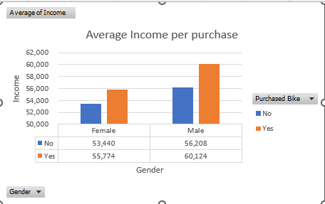
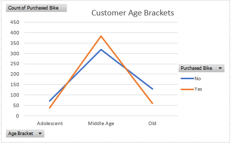
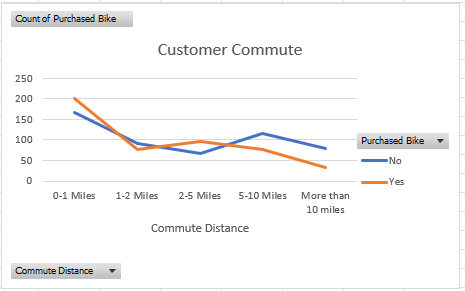
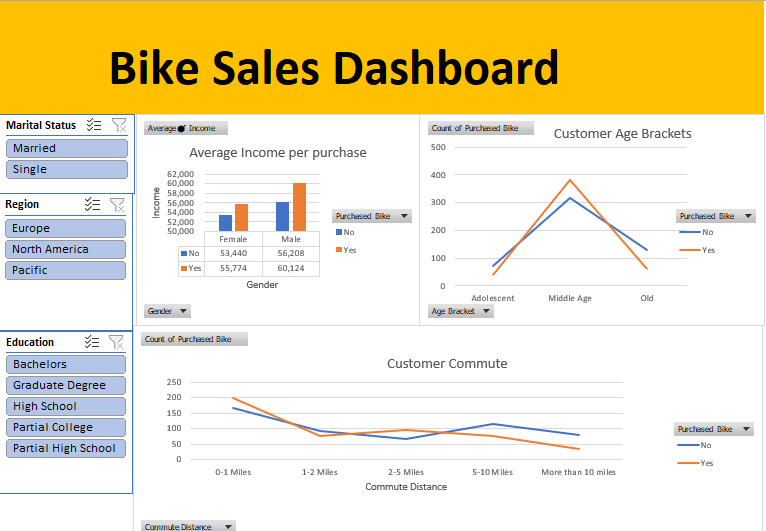

# BikerSales

## Project Overview
Analyzed biker sales across three regions: **Europe, North America, and Pacific**, segmented by marital status, education level, and customer demographics to provide insights on sales trends and customer behavior.

## Features
- Interactive slicers for **Marital Status, Region, and Education Level**  
  (Bachelor, Graduate, High School, Partial College, Partial High School)  
- Charts and metrics for:  
  - **Consumer Commute vs Sales**  
  - **Income per Purchase**  
  - **Customer Age Brackets**  
- Highlighted top-performing regions, demographics, and products

## Impact
- Enabled **data-driven marketing and inventory decisions**  
- Identified **high-performing customer segments and regions**  
- Improved **regional sales visibility** and promotional targeting

## Tech Stack
- Excel (Pivot Tables, Charts, Slicers)  
- Dashboard Visualization

## Data Preview

## Dashboard Preview

